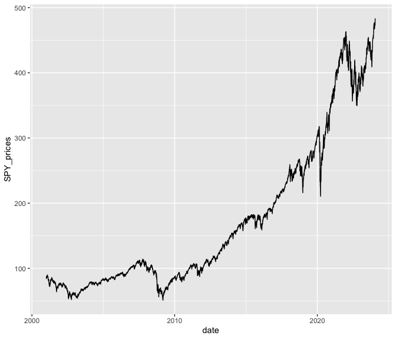
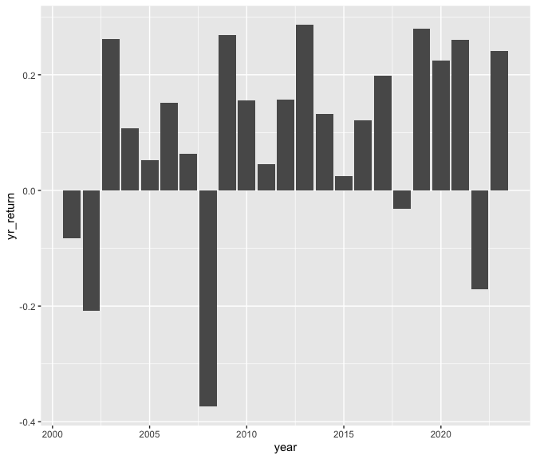

DSE3101_Lecture 2
================
Zitin Bali
2024-01-26

- [Statistics on Returns](#statistics-on-returns)
- [S&P Prices](#sp-prices)
- [S&P Yearly Returns](#sp-yearly-returns)

``` r
library(tidyverse)
```

    ## ── Attaching core tidyverse packages ──────────────────────── tidyverse 2.0.0 ──
    ## ✔ dplyr     1.1.4     ✔ readr     2.1.5
    ## ✔ forcats   1.0.0     ✔ stringr   1.5.1
    ## ✔ ggplot2   3.4.4     ✔ tibble    3.2.1
    ## ✔ lubridate 1.9.3     ✔ tidyr     1.3.1
    ## ✔ purrr     1.0.2     
    ## ── Conflicts ────────────────────────────────────────── tidyverse_conflicts() ──
    ## ✖ dplyr::filter() masks stats::filter()
    ## ✖ dplyr::lag()    masks stats::lag()
    ## ℹ Use the conflicted package (<http://conflicted.r-lib.org/>) to force all conflicts to become errors

## Statistics on Returns

``` r
stocks <- readRDS('./wk2_stocks.rds')

cumulative_returns = sum(stocks$SPY_returns)*100
ave_daily_returns = mean(stocks$SPY_returns)*100
std_dev = sd(stocks$SPY_returns)*100
```

- The cumulative returns of the S&P index during this period is 218.33%.

- The average daily returns of the S&P index during this period is
  0.04%.

- The standard deviation of the daily returns of the S&P index during
  this period is 1.22%.

## S&P Prices

``` r
ggplot(data = stocks, aes(x = date, y = SPY_prices)) +
  geom_line(data = stocks, aes(x = date, y = SPY_prices))
```

<!-- -->

## S&P Yearly Returns

``` r
stocks %>%
  mutate(year = year(date)) %>%
  filter(year <= 2023) %>%
  group_by(year) %>%
  summarise(yr_return = sum(SPY_returns)) %>%
  ggplot(aes(x = year, y = yr_return)) + 
  geom_col()
```

<!-- -->
